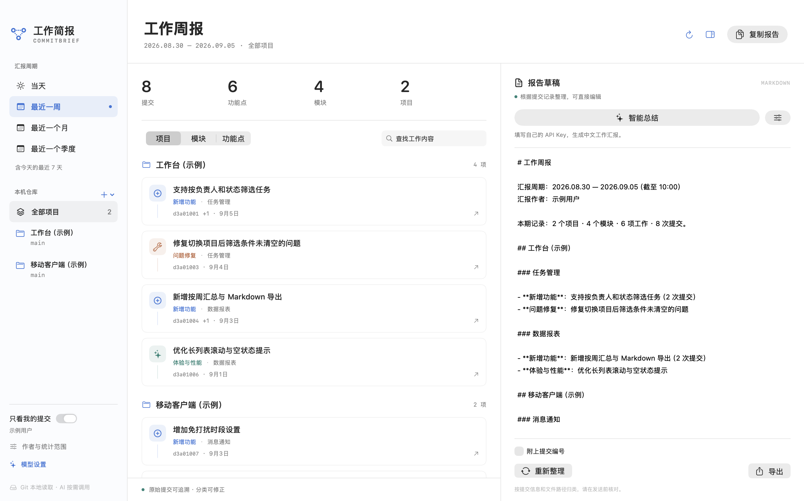
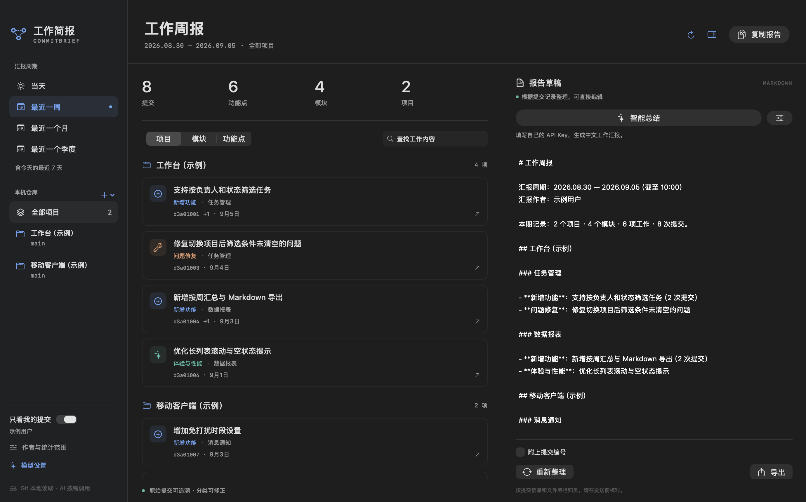
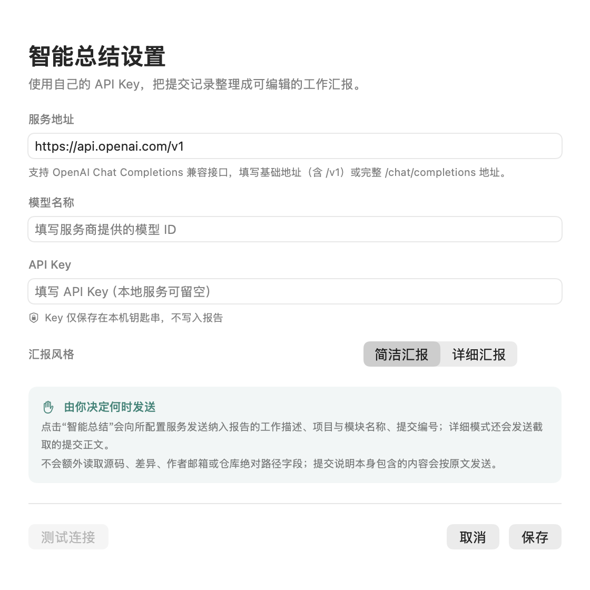

  

<h1 align="center">工作简报 · CommitBrief</h1>

从 Git 提交到工作汇报，把这一周做过的事整理清楚。

  原生 macOS 应用 · 本地仓库 · 中文汇报 · 自选大模型

  <a href="https://github.com/GpsLypy/CommitBrief/releases/latest">下载最新版 DMG</a> ·
  <a href="docs/AI.md">大模型设置</a> ·
  <a href="docs/PRIVACY.md">隐私与数据</a> ·
  <a href="https://github.com/GpsLypy/CommitBrief/issues">反馈问题</a>

CommitBrief 面向需要写日报、周报和阶段汇报的开发者。添加电脑上的 Git 仓库，选择时间范围，就能查看按项目、模块和功能点整理的工作记录，核对原始提交，再编辑、复制或导出 Markdown 汇报。

本地整理无需账户或 API Key。需要更自然的中文表达时，可以接入自己的大模型服务，合并相关工作、整理英文提交，并保留可核对的提交依据。

**本仓库公开产品文档、界面展示和 DMG 安装包；应用源代码不公开。** GitHub 自动生成的 “Source code” 压缩包仅包含本仓库的文档与素材，不包含应用源码，也不是安装包。

## 界面预览

查看深色模式与大模型设置

界面展示使用虚构的示例项目与提交，报告为应用实际生成的本地整理结果；不包含真实工作仓库、账户或 API Key。

## 下载与安装

| 项目 | 当前支持 |
| --- | --- |
| 最新公开版本 | 0.2.0 |
| 系统 | macOS 15 或更新版本 |
| 芯片 | Apple Silicon：M 系列 Mac，arm64 |
| 依赖 | 本机可用的 Git；系统提示缺少开发者工具时，按 macOS 指引安装命令行工具 |
| 安装形式 | DMG，拖入 Applications |
| 更新方式 | 从 Releases 手动下载并替换应用 |

1. 打开 [最新版本](https://github.com/GpsLypy/CommitBrief/releases/latest)，下载 `CommitBrief-0.2.0-macos-arm64.dmg`。
2. 打开 DMG，把 **CommitBrief.app** 拖入 **Applications（应用程序）**。
3. 从应用程序文件夹启动，添加本机 Git 仓库。

当前安装包使用临时签名（ad hoc），**尚未经过 Apple Developer ID 签名与公证**。首次打开可能被 macOS 拦截；确认文件来自本仓库后，可按照系统“隐私与安全性”中的“仍要打开”提示处理。无需关闭系统安全功能。可用 Release 中的 `SHA256SUMS.txt` 核对下载文件。

目前没有 Intel 版、App Store 版或自动更新功能。

## 能做什么

| 功能 | 如何帮助你 |
| --- | --- |
| 多仓库汇总 | 同时添加多个本地仓库，选择参与汇报的项目，汇总前端、后端或独立工具的工作。 |
| 四种时间范围 | 当天、最近一周、最近一个月、最近一个季度，覆盖日报、周报和阶段复盘。 |
| 项目、模块、功能点视图 | 按项目查看整体工作，按模块核对归类，按功能变更类型浏览工作项。 |
| 作者与分支筛选 | 默认只看自己的当前分支提交；支持多个作者身份、全部作者、全部本地分支与标签。 |
| 可追溯的工作记录 | 展开原始提交，查看标题、正文、作者、时间、SHA 和修改文件。 |
| 手动修正 | 调整汇报描述和模块，把不需要的提交从报告排除，也可以恢复。 |
| Markdown 草稿 | 自动生成后继续编辑，预览、复制或导出 `.md`；可选择附上提交编号。 |
| 可选 AI 总结 | 使用自己的 API Key 和兼容接口，把提交整理为中文，归并相关工作。 |
| 草稿保护 | 范围变化时保留手动草稿并提示；重新整理或 AI 生成后可恢复上一份报告。 |
| 原生桌面体验 | 支持浅色与深色模式、本地文件选择和常用快捷键。 |

提交数、模块数与功能点数用于说明报告范围，不代表工作价值或绩效分数。

## 写一份周报

1. **添加项目**：选择一个或多个本地 Git 仓库，也可以扫描它们的上级目录。
2. **确定范围**：选择“最近一周”，勾选项目，确认作者与分支范围。
3. **核对工作**：切换项目、模块或功能点视图，修正描述与模块，排除无关提交。
4. **整理表达**：直接使用本地报告，或配置模型后点击“智能总结”。
5. **完成汇报**：在右侧编辑 Markdown，复制到工作文档，或导出为文件。

搜索框只过滤中间列表的显示，不改变报告或 AI 输入范围。要从报告中去掉某项工作，请使用“从报告排除”或调整项目、作者和时间范围。

| 快捷键 | 操作 |
| --- | --- |
| `⌘ O` | 添加仓库 |
| `⌘ R` | 刷新提交 |
| `⇧ ⌘ C` | 复制报告 |
| `⇧ ⌘ E` | 导出 Markdown |

## 时间、作者与分类口径

| 选项 | 实际范围 |
| --- | --- |
| 当天 | 本机时区今天 00:00 至当前时间 |
| 最近一周 | 含今天在内的最近 7 天，从首日 00:00 至当前时间 |
| 最近一个月 | 含今天在内的最近 30 天，从首日 00:00 至当前时间 |
| 最近一个季度 | 含今天在内的最近 90 天，从首日 00:00 至当前时间 |

时间筛选使用 Git 的 **committer date（提交时间）**，不是 author date；rebase 或 cherry-pick 可能改变这一时间。最近一周、一个月和一个季度均为滚动范围，不是自然周、自然月或自然季度。

默认使用每个仓库的 Git 用户邮箱匹配作者；没有邮箱时退回到完整用户名。在“作者与统计范围”中，可输入多个邮箱或完整作者姓名，以逗号或分号分隔，按不区分大小写的完整值匹配。自定义作者对所有项目生效，并取代默认的个人身份筛选。查看全部作者时，清空自定义作者并关闭“只看我的提交”。

默认读取当前分支可达的提交，并排除合并提交。可选择包含合并提交，或读取全部本地分支、远程跟踪分支与标签；应用不会自动更新远端记录。同一仓库、不同引用下相同 SHA 只统计一次。

- **项目**对应添加的 Git 仓库，使用目录名展示。
- **模块**优先参考约定式提交的 scope，再参考主要修改路径；每条提交归入一个主要模块，可手动更正。
- **功能点**由本地规则归并同一仓库、模块和变更类型下标题相同的提交。AI 会在汇报文本中进一步整理语义相关的工作，左侧统计和原始分类仍然保留。

## 接入自己的大模型

支持 **OpenAI Chat Completions 兼容接口**，服务地址和模型 ID 均可自定义，也可连接提供兼容接口的本机模型服务。

打开“模型设置”，填写服务商提供的地址、模型 ID 和 API Key，选择“简洁汇报”或“详细汇报”，保存后手动点击“智能总结”。API Key 保存在 macOS 钥匙串；不接入模型也可以使用全部本地整理功能。

“测试连接”只发送一条简短测试消息，不发送 Git 记录，但可能产生服务商调用费用。保存设置不会发送提交；智能总结也不会自动在后台运行。

总结会发送纳入报告的项目与模块名称、工作描述、原始提交标题、SHA，以及统计日期和数量；详细模式还发送每条提交正文的前 600 个字符。不发送源码、diff、变更文件列表或当前报告草稿，也不单独发送作者身份与绝对仓库路径字段。**文本内容不会自动脱敏**，请核对需要交给所选服务处理的记录。

完整请求上限为 300 KB；超出时会提示缩短范围，不会静默丢弃提交。生成过程可取消，失败或输出截断时保留原稿；等待完整响应后才替换报告，目前不逐字展示输出。模型输出仍需人工核对。

详细配置、兼容范围与故障排查见 [大模型设置](docs/AI.md)，完整的数据边界见 [隐私与数据说明](docs/PRIVACY.md)。

## 常见问题与当前边界

**为什么看不到某条提交？** 先检查时间、作者、项目和分支筛选。应用只读取本机已有的提交，不包含未提交修改，也不会执行 fetch 或 pull。默认排除合并提交；“只看我的提交”依赖正确的 Git 作者身份。

**扫描为什么没发现嵌套仓库？** 扫描最多向下查找 3 层，并在发现仓库后停止向其内部递归。独立嵌套仓库请单独添加；部分依赖与构建目录会跳过。

**能保证一项工作只出现一次吗？** 同一仓库的相同 SHA 会去重，标题相同的相关提交可按规则归并；不同 SHA 的 cherry-pick 或多个工作副本仍可能重复表达同一工作。建议每个项目只添加一个工作副本，再按需启用全部分支。

**AI 能补全业务收益、测试结果或下周计划吗？** 提示词要求仅按提交证据整理，不编造没有记录的效果或计划。提交本身缺少的信息请由你补充，AI 输出也需要核对。

**会修改或上传仓库吗？** 本地整理只读取 Git 记录与配置，不修改仓库文件，不执行 commit、push、fetch 或 pull。只有主动点击“智能总结”或“测试连接”才会请求你配置的模型接口；详见隐私说明。

**是否保存历史周报？** 应用保存当前草稿，并提供上一份报告的恢复。它不是多版本报告档案；需要长期保存的汇报请导出 Markdown。

**大型仓库有哪些限制？** 单仓库单次最多读取 10,000 条提交；达到上限时会显示提示。请缩短统计范围以获得完整汇报。AI 服务还可能有独立的上下文与额度限制。

**还有哪些功能暂未提供？** 当前面向个人本地使用，未提供账户、云端同步、团队协作、定时生成、自动更新或 Intel 安装包。仓库目录移动后需要重新添加；从应用移除项目不会删除仓库。

## 版本与反馈

- [下载与 Release 说明](https://github.com/GpsLypy/CommitBrief/releases)
- [更新日志](CHANGELOG.md)
- [报告问题或建议功能](https://github.com/GpsLypy/CommitBrief/issues/new/choose)

提交反馈时，请提供应用版本、macOS 版本、操作步骤与预期结果。仓库是公开的，请使用脱敏示例，不要附带 API Key、私有代码或内部提交记录。

CommitBrief 参考 [Notch Calendar / claend](https://github.com/GpsLypy/NotchCalendar) 的原生 macOS 应用与 DMG 分发方式，作为独立产品开发。

## Buy me a coffee / 请作者喝杯咖啡

If CommitBrief makes writing your work reports a little easier, you can support its continued development with a coffee. Thank you for every bit of encouragement.

如果 CommitBrief 帮你少花一点时间整理日报和周报，欢迎请作者喝杯咖啡，支持后续开发。感谢每一份支持与鼓励。

  

## 关于本仓库

这是 CommitBrief 的公开分发与反馈仓库。你可以在这里下载安装包、阅读使用说明、查看版本变化并反馈问题。应用保持闭源，本仓库不提供应用源码或源码开源许可。
